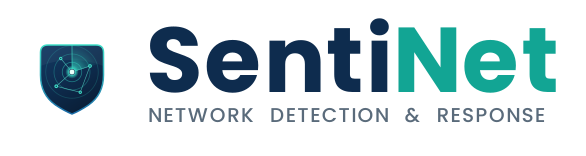

<div align="center">



### Plateforme de supervision et de sécurisation du trafic réseau

*Une sentinelle pour votre réseau — surveiller, détecter, protéger.*


</div>

---

## Présentation

**SentiNet** (contraction de *sentinelle* + *network*) est une plateforme de **supervision et de sécurisation du trafic réseau** de type SOC (*Security Operations Center*). Elle collecte les flux réseau, détecte les menaces en temps réel via un moteur d'analyse comportementale et par signatures, orchestre la réponse (blocage, quarantaine, playbooks SOAR) et journalise chaque action critique dans une piste d'audit inaltérable.

L'interface web offre à l'analyste SOC un tableau de bord temps réel, la cartographie du réseau, la gestion des détections et de la threat intelligence, la matrice MITRE ATT&CK, ainsi qu'un module d'administration complet (RBAC, MFA, rétention & conformité RGPD).

> Conçue et documentée à partir d'un cahier des charges formel (exigences EF-xxx / ENF-xxx), la plateforme couvre l'ensemble du cycle **détection → décision → réponse → audit**.

---

## Fonctionnalités clés

### 🛰️ Collecte & observabilité
- Capture des flux via les APIs natives de l'OS, **multi-plateforme** — Windows (`netstat`, `arp`, PowerShell, `netsh`) et Linux (`ss`, `ip neigh`, `ping`, `/proc/net/dev`, `iptables`) — sans driver ni dépendance externe.
- Suivi et pruning des sessions TCP/UDP actives, ingestion des métadonnées de flux.
- Filtres de capture BPF configurables par segment (DMZ, WAN, LAN est-ouest, DNS).
- Synchronisation temporelle vérifiée (`w32tm` / NTP).

### 🎯 Détection des menaces
- **Beaconing C2** : analyse statistique des intervalles de connexion (coefficient de variation < 0,15).
- **Mouvement latéral** : détection SMB/RDP/WinRM/SSH vers ≥ 4 hôtes internes.
- **Balayage de ports** : ≥ 25 ports TCP distincts depuis une même source.
- **Anomalie volumétrique** : détection des pics de débit (> 800 Mbps).
- **Signatures** : moteur de règles configurables (`signatures.json`) avec éditeur intégré (CRUD complet).
- **Threat intelligence** : ingestion de **vrais flux publics** (Feodo Tracker, SSLBL d'abuse.ch, Blocklist.de), enrichissement des alertes, cartographie **MITRE ATT&CK** calculée sur les alertes réelles.
- **Scoring de risque** statistique sur chaque alerte.

### 🛰️ Sondes distribuées (agents est-ouest)
- **Agents-sondes** déployables sur d'autres machines : capture du trafic du segment (`tcpdump`, repli `ss`), remontée sécurisée (clé d'agent partagée) au serveur central.
- Détection **est-ouest** (balayage, mouvement latéral, beaconing) sur le trafic **observé**, avec attribution **par domaine, réseau et sonde**.
- Console **Sondes & Agents** : supervision des capteurs et gestion des intrusions par domaine / segment.

### 🛡️ Réponse & orchestration
- **Blocage temps réel** via `netsh advfirewall` (Windows), bidirectionnel.
- **Liste blanche anti-emballement** (EF-508) : vérification systématique des actifs critiques avant tout blocage.
- **Playbooks SOAR** conditionnés au score de risque.
- **Validation humaine** obligatoire pour les actions à fort impact (file d'attente Approuver / Rejeter).

### 📜 Audit & conformité
- **Piste d'audit inaltérable** (EF-904) : chaînage SHA-256 (`hash = SHA256(entry + prevHash)`), stockage append-only, vérification d'intégrité complète.
- **Rétention & RGPD** : politiques de rétention paramétrables, pseudonymisation (SHA-256 + sel) des données personnelles.
- **Authentification** : connexion e-mail + mot de passe (**hachage scrypt**), **MFA TOTP** (QR code), sessions signées (HS256) ; **toutes** les routes API et le WebSocket sont protégés.
- **RBAC** : gestion des utilisateurs, rôles et privilèges (moindre privilège).

### 📊 Interface analyste (SPA React)
Tableau de bord temps réel · Cartographie réseau · Détection & règles · Alertes · Trafic · Threat Intel · Réponse · Rapports & KPI (MTTD/MTTR/faux positifs) · Administration.

---

## Stack technique

| Couche | Technologie |
|---|---|
| Frontend SPA | React 18 + Vite 4 |
| Styles | Tailwind CSS |
| Graphiques | Recharts |
| Icônes | Lucide React |
| Routing | React Router 6 |
| Backend API | Node.js 18+ / Express 4 (CommonJS) |
| Temps réel | WebSocket (`ws`) |
| Collecte réseau | Shells OS multi-plateforme (Windows : `netstat`/PowerShell/`netsh` · Linux : `ss`/`ip`/`iptables`) |
| Auth / MFA | `otplib` + `qrcode` |
| Persistance | JSON on-disk (audit append-only, whitelist, signatures) |
| Dev | `concurrently` (front + back en une commande) |

Détails complets dans **[`ARCHITECTURE.md`](ARCHITECTURE.md)**.

---

## Prérequis

- **Node.js 18 ou supérieur** et **npm**
- **Windows** ou **Linux** — la collecte réseau et le blocage pare-feu sont portés sur les deux (Windows : `netstat`/`netsh`/PowerShell · Linux : `ss`/`ip`/`iptables`).
- Droits **administrateur / root** (ou capacité `cap_net_admin`) recommandés pour l'application effective des blocages pare-feu. Sans privilèges, les blocages sont journalisés mais non appliqués (repli gracieux).

---

## Installation

```bash
# 1. Cloner le dépôt
git clone https://github.com/Scouzy/SentiNet.git
cd SentiNet/sentinet-app

# 2. Installer les dépendances
npm install

# 3. (Optionnel) Configurer l'environnement
copy .env.example .env
#   puis éditer .env pour renseigner les secrets et l'origine CORS
```

---

## Lancement

```bash
# Démarrer le frontend ET le backend en une seule commande
npm run dev
```

| Service | URL | Port |
|---|---|---|
| Interface web (Vite) | http://localhost:5210 | `5210` |
| API + WebSocket (Express) | http://localhost:3010 | `3010` |

Le frontend proxifie automatiquement `/api` et `/ws` vers le backend (voir `vite.config.js`).

Autres scripts :

```bash
npm run dev:client   # frontend seul (Vite)
npm run dev:server   # backend seul (Node/Express)
npm run build        # build de production du frontend
npm run preview      # prévisualisation du build
```

---

## Structure du projet

```
SentiNet/
├── ARCHITECTURE.md                 # Dossier d'architecture technique & sécurité
├── Cahier_des_charges_SentiNet.*   # Cahier des charges (md / docx / pdf)
├── Todolist_SentiNet.md            # Suivi d'avancement (exigences EF/ENF)
├── sentinet-brand.md               # Mémo d'identité visuelle
├── LICENSE
├── README.md
└── sentinet-app/                   # Application
    ├── index.html
    ├── vite.config.js
    ├── tailwind.config.js
    ├── package.json
    ├── ecosystem.config.cjs        # Config PM2 (prod)
    ├── .env.example                # Modèle de configuration
    ├── public/                     # Logos, icônes, favicon, manifest PWA
    ├── logs/                       # Piste d'audit runtime (audit.log — non versionné)
    ├── agent/                      # Agent-sonde distant (sniffing + remontée)
    │   ├── sentinet-agent.js
    │   └── README.md
    ├── test/                       # Kit de test d'intrusion (validation Phase 4)
    │   ├── intrusion-test.sh
    │   └── INTRUSION-TEST.md
    ├── server/                     # Backend
    │   ├── index.js                # API REST + WebSocket + ingestion agents
    │   ├── services/               # detection · platform · auth · threatintel · audit · whitelist
    │   ├── scripts/                # create-admin.js
    │   ├── config/                 # retention.json
    │   └── data/                   # signatures, whitelist, bpf-filters, mitre, playbooks, db
    └── src/                        # Frontend React
        ├── pages/                  # Dashboard, Alerts, Network, Sensors, Traffic,
        │                           #   Detection, Response, ThreatIntel, Reports, Admin, Login
        ├── context/                # AuthContext
        ├── components/             # Layout (Header, Sidebar) + UI
        ├── hooks/                  # useWebSocket
        └── services/               # api.js
```

---

## Sécurité & conformité

- Headers HTTP de sécurité (`X-Content-Type-Options`, `X-Frame-Options`, `X-XSS-Protection`).
- CORS restreint à l'origine du frontend en production.
- Whitelist anti-emballement sur tous les blocages pare-feu (EF-508).
- Audit inaltérable de toute action à fort impact avec vérification d'intégrité (EF-904).
- Secrets externalisés via variables d'environnement (`.env`) — jamais commités.
- Rétention et pseudonymisation conformes RGPD (voir `server/config/retention.json`).

> ⚠️ En développement sous Windows, la collecte utilise les APIs OS en mode non-promiscuité. En production, déployer des sondes physiques/virtuelles avec accès promiscuité (DPDK/PF_RING pour 10 Gbps+). Voir `ARCHITECTURE.md §5`.

---

## Statut du projet

**56/65 tâches complétées (86 %)** — l'essentiel du périmètre logiciel est opérationnel.

| Phase | Complétées | Statut |
|---|:--:|:--:|
| P0 — Cadrage & conception | 7/9 | 🟡 En cours |
| P1 — Socle & capture | 8/9 | 🟡 En cours |
| P2 — Détection | 11/11 | ✅ Terminé |
| P3 — Réponse & QoS | 9/9 | ✅ Terminé |
| P4 — Industrialisation | 7/9 | 🟡 En cours |
| P5 — Recette & tests | 5/7 | 🟡 En cours |
| P6 — Exploitation | 4/6 | 🟡 En cours |
| Transverses | 5/5 | ✅ Terminé |

Les tâches restantes nécessitent soit du **hardware physique** (capture DPDK/PF_RING, carte bypass fail-open, cluster HA), soit des **actions organisationnelles** (ateliers de cadrage, budget, contrats de maintenance, formation SOC) — non implémentables en logiciel seul. Détail complet dans **[`Todolist_SentiNet.md`](Todolist_SentiNet.md)**.

---

## Déploiement (VPS)

Un guide complet de mise en production (Ubuntu/Debian, **nginx + PM2 + HTTPS Let's Encrypt**) est fourni dans **[`DEPLOYMENT.md`](DEPLOYMENT.md)**. Fichiers associés : `sentinet-app/ecosystem.config.cjs` (PM2) et `deploy/nginx-sentinet.conf` (reverse proxy).

```bash
# En résumé, sur le VPS :
git clone https://github.com/Scouzy/SentiNet.git /var/www/sentinet
cd /var/www/sentinet/sentinet-app
cp .env.example .env          # renseigner CORS_ORIGIN, générer AGENT_KEY (openssl rand -hex 24)
npm install && npm run build
# Créer le premier compte admin (mot de passe via $ADMIN_PASSWORD)
ADMIN_PASSWORD=... node server/scripts/create-admin.js "admin@exemple.fr" "Nom" "Admin Plateforme"
pm2 start ecosystem.config.cjs && pm2 save
# puis configurer nginx + certbot (voir DEPLOYMENT.md)
```

Déploiement d'une **sonde** sur une autre machine : voir **[`agent/README.md`](agent/README.md)**.
Validation par **test d'intrusion** : voir **[`test/INTRUSION-TEST.md`](test/INTRUSION-TEST.md)**.

---

## Documentation

- **[`DEPLOYMENT.md`](DEPLOYMENT.md)** — guide de déploiement VPS (nginx, PM2, HTTPS).
- **[`agent/README.md`](agent/README.md)** — déploiement d'un agent-sonde distant.
- **[`test/INTRUSION-TEST.md`](test/INTRUSION-TEST.md)** — test d'intrusion de validation.
- **[`ARCHITECTURE.md`](ARCHITECTURE.md)** — architecture technique, flux de données, sécurité, conformité, performances.
- **[`Cahier_des_charges_SentiNet.md`](Cahier_des_charges_SentiNet.md)** — cahier des charges détaillé (exigences EF/ENF).
- **[`Todolist_SentiNet.md`](Todolist_SentiNet.md)** — suivi d'avancement par phase.
- **[`sentinet-brand.md`](sentinet-brand.md)** — identité visuelle et charte graphique.

---

## Licence

Logiciel **propriétaire — tous droits réservés**. Voir **[`LICENSE`](LICENSE)**.
Toute reproduction ou réutilisation, totale ou partielle, sans autorisation écrite préalable est interdite.

---

<div align="center">

**SentiNet v3.2** · Développé par [Scouzy](https://github.com/Scouzy)

</div>
